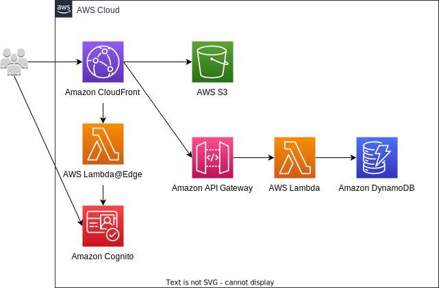

# todo-app-practice-1

## API ドキュメント

https://matsu3m.github.io/todo-app-practice-1/api-doc.html

## アーキテクチャ

## 技術スタック

### フロントエンド

- TypeScript
- React
- Vite
- Chakra UI

### バックエンド

- Python
- FastAPI
- Boto3
- pytest

### データベース

- Amazon Dynamo DB

### クラウドリソース管理

AWS Cloud Development Kit

## ローカル開発環境の構築手順

### 前提

- [VS Code](https://code.visualstudio.com/) が利用可能であること
- [Docker](https://www.docker.com/products/docker-desktop/) が利用可能であること
- VS Code に [Dev Containers 拡張](https://marketplace.visualstudio.com/items?itemName=ms-vscode-remote.remote-containers) がインストールされていること

### Dev Container の立ち上げ

1. リポジトリをローカル環境にクローンする。

2. Visual Code でクローンしたプロジェクトを開く。

3. コマンドパレットを開き、`Dev Containers: Reopen in Container` を選択する。

### 開発用サーバの立ち上げ

1. `startup-dev-server.sh` を実行する。

### ユニットテストの実行

1. `backend` に移動する。

2. `poe test` を実行すると、tests フォルダ配下に存在するテストが実行される。

3. 左下の Watch をクリックすると、エディタ上でカバレッジを確認可能。
